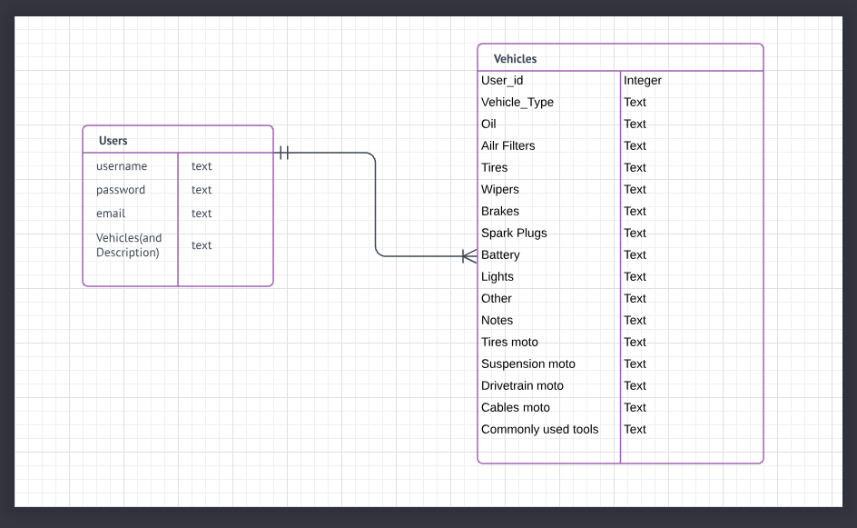
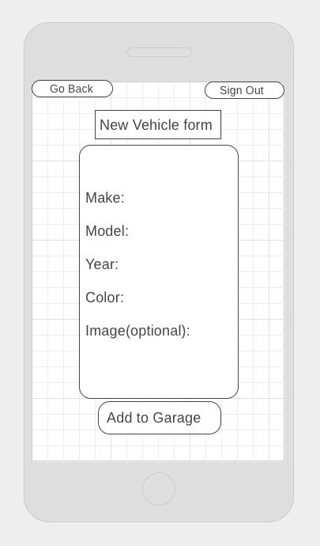
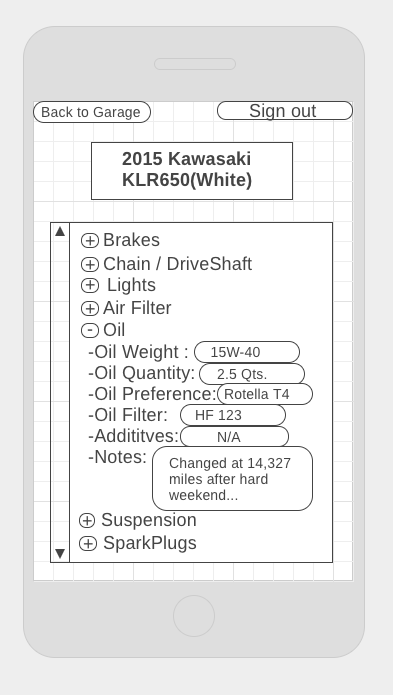

## Capstone Project Proposal ##
## MVP: ##
Helps user track oil changes in a mobile setting.

## Project Description: ##

Garage Manager -
A mobile app that allows users to add any number of vehicles to their “Garage”. Allowing the user to keep track of consumables for the vehicle, as well as keeping track of specifics, such as oil weight and tire size. And a notes section to help them keep track of when they did certain services, what type of tires, etc.

## Problem Statement: ##

Like many DIYers, I greatly enjoy servicing my own vehicles, and the vehicles of my friends. But like almost everyone, I struggle to keep track of all the specific little things my vehicles need, let alone the parts for all the random vehicles that end up in my garage on the weekends.

Picture this, you are in the back of an auto parts store, you are staring at a wall of thousands of  filters with random numbers printed all over the boxes. You go to the book hanging on the wall, the ancient looking one with all the different vehicles and their respective part numbers. The page with your specific Toyota on it has been ripped out, great. You try googling an answer, but you have no service in the back of that quiet old building, or the forum you find has 7 different answers to a very simple question.

You finally have to cave in and go to the man with the computer and tell him what you are looking for. He quickly pecks at his keyboard and tells you which item you need. You buy it, drive 15-30 minutes home, and start taking apart your car. You get to the filter and its the wrong one (maybe for a 4 cylinder motor instead of the 6 cylinder). Now you have to go back, but you have no way of getting to the shop because you already took the car apart. If you have ever done work on your own vehicle, this is a very easy thing to picture, it has happened to all of us at least once. I want to fix that.

## Problem Solution: ##

I would like to develop a mobile app, that allows the user to build multiple pages, one per vehicle they work on. It will have multiple drop down sections, with easy data entry points, as well as sections to keep notes and logs of work performed or important / helpful notes. This will allow users to quickly and easily keep track of all the specific items they use as they jump from vehicle to vehicle. They can just simply fill in the information as they work, avoiding any inconvenience in the future. Nobody knows your vehicle like you do, and now you don’t have to hope they do.

## User Stories (First Iteration): ##

User can login
	-User starts at login screen where they can type in their username and password, or sign-up, creating a new account. Would like to get fully functioning auth. (Stretch)

User can add vehicle to “Garage”
	-User clicks the add vehicle button, and specifies if the vehicle is a “Truck / Car” or “Motorcycle / Rec vehicle” A form will pop up where they can start entering their notes and part numbers.

User can update vehicles that already exist in “Garage”
	-All pages will constantly be updateable. You can click on any section of the form and add/ alter the information there. A large update button at the bottom with save the changes.

User can remove vehicles if they no longer want them in “Garage”
	-If you sell a vehicle or do not work on it any longer, you can delete it.

User can use map to find local shops for parts/ service (Stretch Goal)
 	-If you are unfamiliar with the area in which you are working on your vehicle, you can pull up a map within the app and search for nearby shops.

## Planned Technologies: ##

(This list may change slightly)
React Native, PorstgreSQL, Knex, Node, CSS3, HTML5, JavaScript, Postman, Firebase, Heroku, Android App store, GitHub, BootStrap / Materialize, Leaflet. 

## ERD - Entity Relationship Diagram: ##

## Wireframes: ##

## Other Notes ##
DataBase:
-Profile,
-Vehicle List,
-Specific vehicle within that list,
-Frequently used parts for said vehicle,
-Notes about the specific vehicle,

Vehicle List: 
-Make
-Model
-Color
-Year 
-Nickname?
-Image?

Specific Vehicle:   (Multiple drop downs?)(For Cars and Trucks)
-Make
-Model
-Color
-Year
-Engine Size
-Transmission
-Drive Train

-Oil weight
-Oil Quantity
-Oil Brand/Type of choice (Multiple options?)
-Oil Filter (Multiple brands and their numbers)

-Air Filter (Multiple brands and their numbers)
-Cabin Filter (Multiple brands and their numbers)

-Tire Size
-Vehicle specific tire pressure

-Wiper blade length(Prefered brand/type)

-Brake pads front(Prefered brand/type)
-Brake pads rear(Prefered brand/type)

-Spark Plugs (Multiple Brands and their numbers)

-Battery (Model/brand)

-Bulbs Head Lights
-Bulbs Tail Lights
-Misc. Bulbs

-Other items

-Commonly Used tools and sizes

Specific Vehicle:   (Multiple drop downs?)(For Motorcycles and Quads)

-Tire size front
-Tire size rear
-Tire pressure (Road/Dirt?)

-Chain (size and length)
-Belt (size and length)
-Drivetrain Sprocket sizes

-Motor oil weight
-Motor oil quantity
-Motor oil brand/ type of choice
-Motor oil filter

-Fork oil weight
-Fork oil quantity
-Fork oil brand/ type of choice

-Air Filter
-Air Filter Oil

-Throttle cable lengths
-Clutch cable length
-Choke cable length

-Brake pads front(Prefered brand/type)
-Brake pads rear(Prefered brand/type)
-Brake fluid

-Spark Plugs (Multiple Brands and their numbers)

-Battery (Model/brand)

-Bulbs Headlights
-Bulbs Tail Lights
-Misc. Bulbs

-Other items

-Commonly Used tools and sizes

Specific vehicle notes:
-A section that allows the owner to keep track of services completed on the vehicle, whats and whens. Anything of note to keep track of, adjustments made on the road etc. allowing them to create a solid set of service and maintenance records.

FE:

Landing page/ Modal:
Simple login/signup page

Built in Vue or React(Native?)

Vehicle list page:
Include Add ,Edit, Delete vehicle form or a link to said forms

Specific vehicle page:
Different page depending on vehicle (car / moto)
Make the sections on the page collapsible / expandable for readability
Service notes/ other notes section at bottom of list

Nav Bar:
Fixed to top of window
-Home
-FAQ
-Contact/About us
New vehicle form:
-Make
-Model
-Year
-Color
-Nickname(optional)
-Car/Truck or Moto/Quad
--Submit/Create Button

Delete vehicle:
Small button under each vehicle. 
If pushed, pops up modal asking if they really want to delete the vehicle. If click on yes, rerender after BE update. If clicked anywhere else, close modal.

Specific vehicle page:
Everything is fixed within the form.
If Edit button is pressed, everything becomes editable until submit button is pressed. Once button is pressed, the page rerenders with the changes locked in again.
